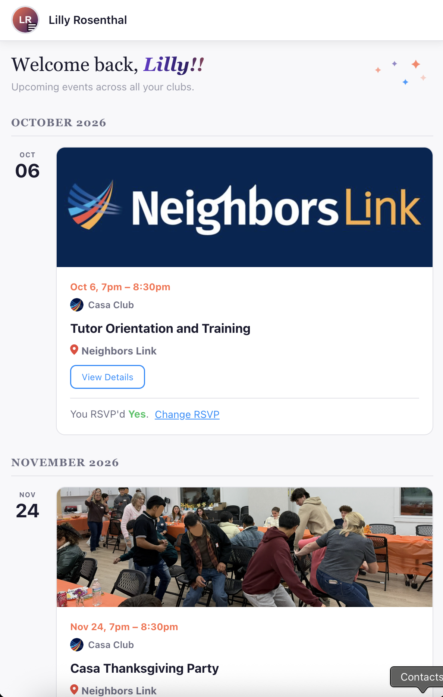
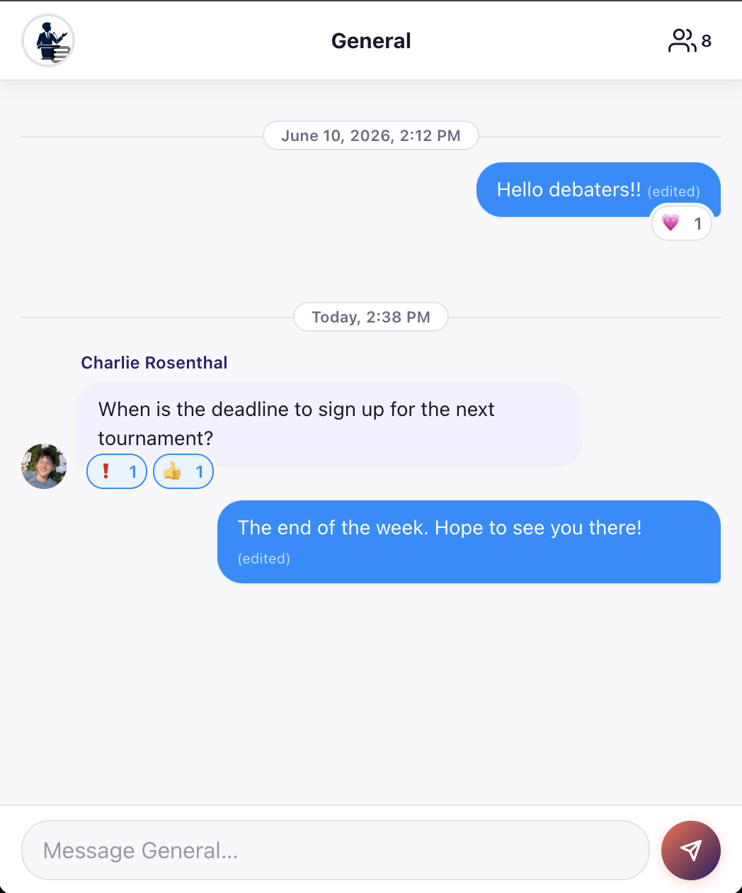
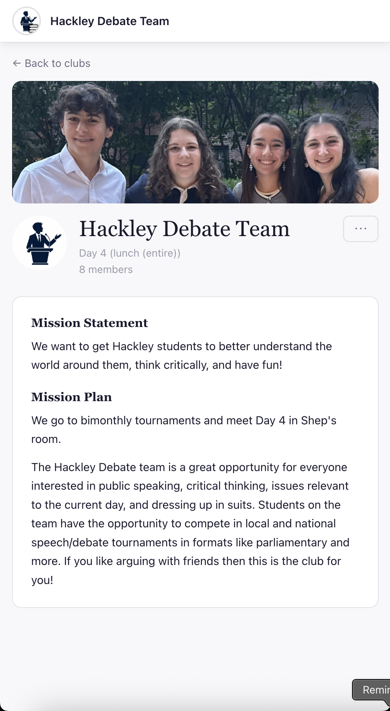
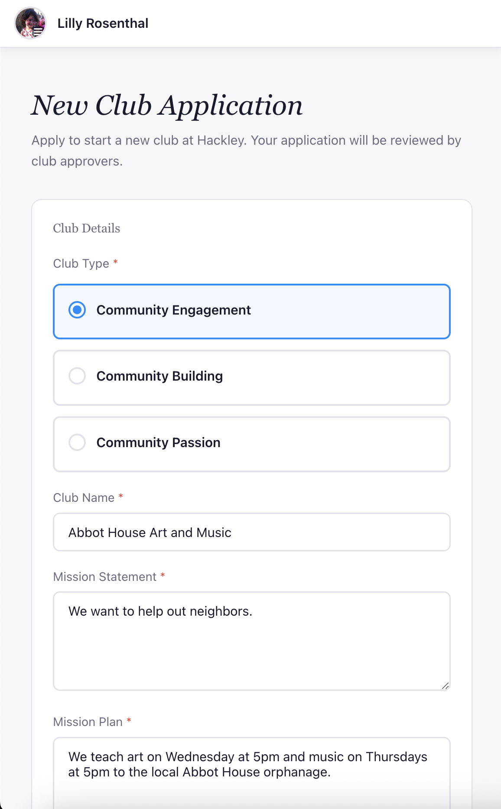

import { Image } from 'astro:assets';
import browse_clubs_image from '../assets/images/browse_clubs.png';

# Hackley Clubz Overview.

Our mission is to centralize how Hackley students engage with clubs, so that it is easier for students to participate in clubs and to run clubs and for faculty to support clubs.

## What the platform does.

### Students can easily browse clubs.

<Image src={browse_clubs_image} alt="browse clubs image" width="700" />

### Students can have a unified calender view of their events.

### Clubs can create/text in chats.

### Students can easily see their club information.

### Students can apply to create new clubs which administrators can approve.

