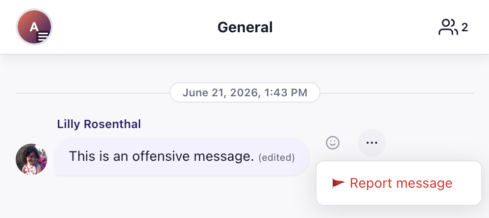
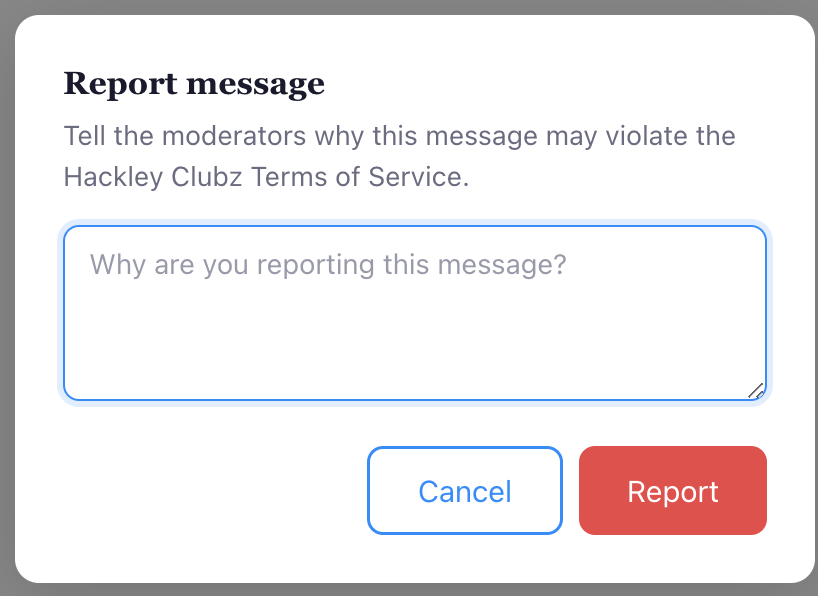
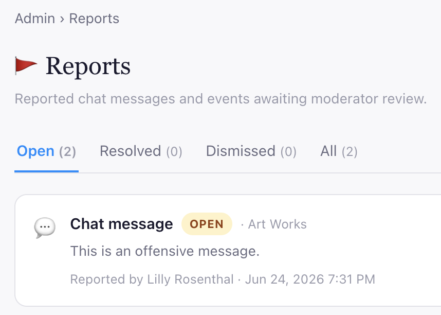
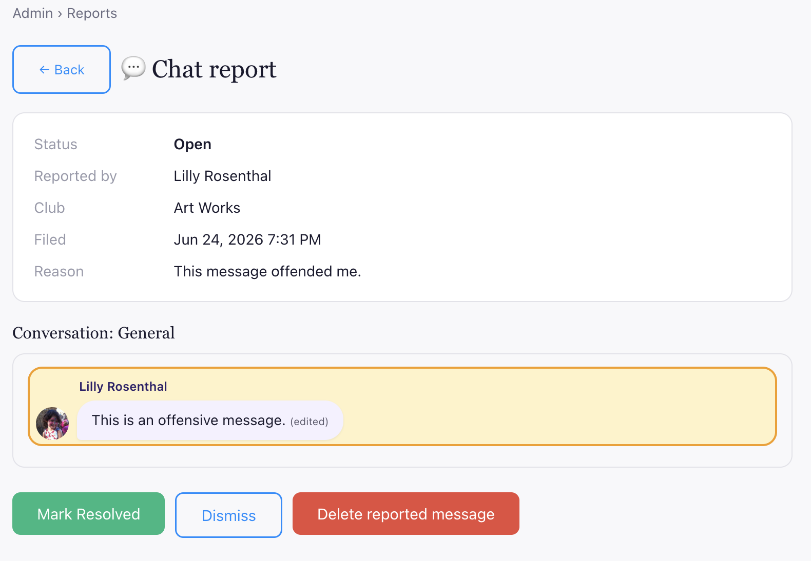

# Reporting Flows

Because users generate content in Hackley Clubz, it is important to allow users to report inappropriate content that they see. This is a requirement for any app with a chat feature in Apple's App Store.

Users can report chats and events by clicking on the triple-dot next to the message (or event).

This opens a modal reporting dialog.

Reports go to the "content moderator" who can resolve the report.

